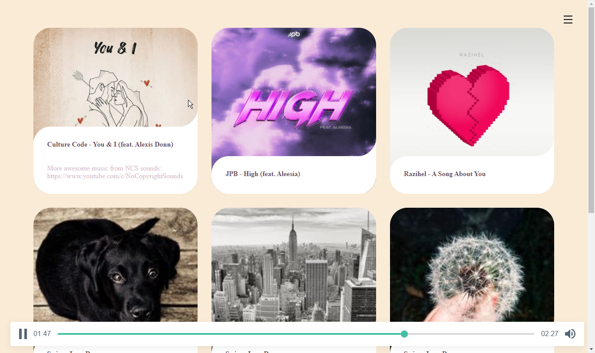

# Audio Player

Card-based minimalist audio/music player in Vue.js



## Demo 

[demo](https://yuis-ice.github.io/audio-player/public/audioplayer/)

## Why 

I searched Google and Github, found some audio/music player apps or boilerplates that does work well but in the way you cannot see the cover images, or cannot see unless moving back and forth the playlist. So I made this, a simple interface yet highly flexible and extensible. Plus, totally free and open-source. 

## Usage 

1. Copy the Audio Player directory

Clone this git and copy the `./public/audioplayer` folder to your data directory. 

(Or you can rebuild the files by `npm run-script build ` if you want.)

2. Create config file 

Edit or create `audioplayer.json` on the root of your data directory. 

The format should be like: 

```yml 
[
    {
        "id": 1,
        "title": "Culture Code - You & I (feat. Alexis Donn)",
        "src": "../songs/Culture%20Code%20-%20You%20%26%20I%20(feat.%20Alexis%20Donn).jpg",
        "path": "../songs/Culture%20Code%20-%20You%20%26%20I%20(feat.%20Alexis%20Donn).mp3",
        "description": "More awesome music from NCS sounds: https://www.youtube.com/c/NoCopyrightSounds"
    },
    {
        "id": 2,
        "title": "JPB - High (feat. Aleesia)",
        "src": "../songs/JPB%20-%20High%20(feat.%20Aleesia).jpg",
        "path": "../songs/JPB%20-%20High%20(feat.%20Aleesia).mp3"
    },
    {
        "id": 3,
        "title": "Razihel - A Song About You",
        "src": "../songs/Razihel%20-%20A%20Song%20About%20You.jpg",
        "path": "../songs/Razihel%20-%20A%20Song%20About%20You.mp3"
    }
]
```

(You can see the full example at `./public/audioplayer/audioplayer.json`)

3. Run the server 

If you haven't yet, clone the git repo

```
git clone [the repo] && cd [the repo]
```

Install the node packages

```
npm install
```

Run the web server and go to the localhost URL, now you can see the web interface on the browser. 

```
node ./server.js --datadir [data directory] -p [port]

# e.g. 
# node ./server.js --datadir ../../c/Users/isla/Music/ -p 8114

```

Or you can use Audio Player on Apache or Nginx or any other web server. 


## Utilities

- ./utils/get_mp3_thumbnails.js

About: 

get/generate thumbnail/cover images from mp3 files on a directory

Usage: 

Edit the variables, then run `node ./utils/get_mp3_thumbnails.js`

- ./utils/audioplayer_json_scaffold.js

About: 

scaffold/generate json file given the mp3 files on a directory for Audioplayer

Usage: 

Edit the variables, then run `node ./utils/audioplayer_json_scaffold.js`

## Development

1. run the webpack server 

```
npm run-script webpack
```

or just build

```
npm run-script build 
```

2. run the express.js web server

```
npm run-script server
```

3. open the localhost url e.g. http://localhost:8114/audioplayer/


